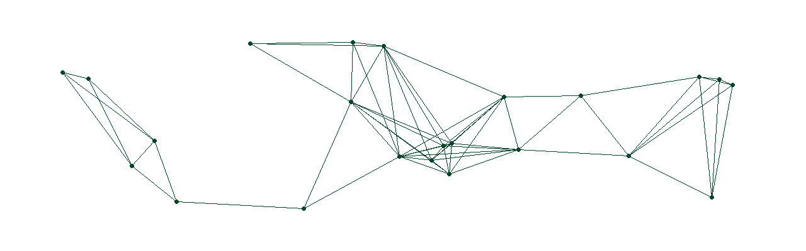

### Hi there, I'm João Paulo Nobre Medeiros 👋

  

 

Junior Cybersecurity Professional.

This GitHub showcases projects, labs, and studies that reflect my technical development and ongoing learning journey in Information Security.

 

## Technologies & Operating Systems

## Infrastructure & Lab Tools

## Security Tools

## Core Areas

* Network Security
* Identity & Access Management (IAM)
* Vulnerability Assessment
* Security Hardening
* Incident Response
* Security Monitoring (SIEM)
* Blue Team Operations
* Access Control
* Linux Administration
* TCP/IP Fundamentals
* ISO 27001 Fundamentals

 

## Contacts

